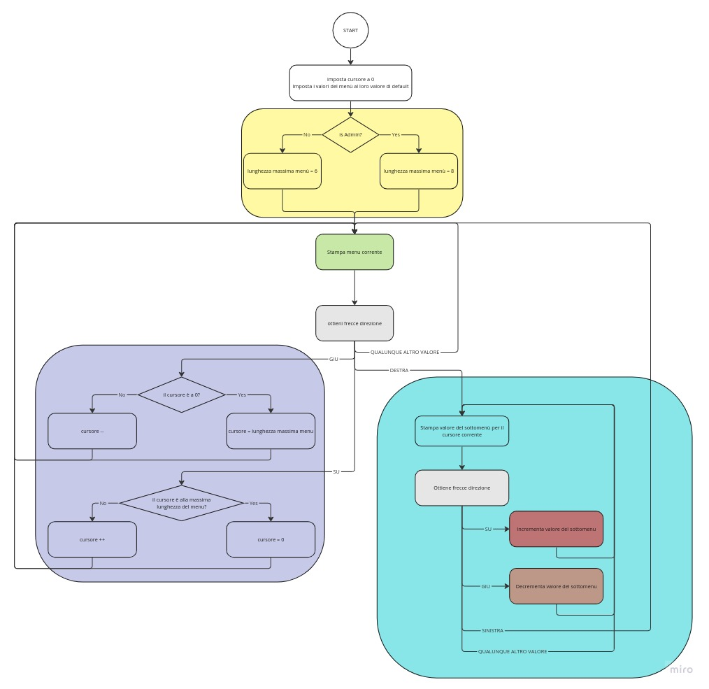

# Cruscotto assembly
_Pasetto Michele VR495361, Tinazzi Camillo _
## interpretazione dei requisiti:
- Il cruscotto deve poter essere eseguito in modalità utente od in modalità "supervisor" (il cui codice, passato come parametro, è 2244).
- Il cruscotto deve poter scorrere le voci del menù, attraverso l'utilizzo delle frecce su e giù seguite da invio.
- Con la freccia destra, l'utente può entrare nel sottomenù della voce corrente, e modificare il valore di tale voce.
- Con la freccia sinistra, l'utente può confermare il nuovo valore ed uscire dal sottomenù per tornare al menu principale.
- Le voci del menu sono:
    1. Setting automobile/Setting automobile(supervisor)
    2. Data: 15/06/2014
    3. Ora: 15:32
    4. Blocco automatico porte: ON
    5. Back-home: ON
    6. Check olio
    7. Frecce direzione (solo supervisor)
    8. Reset pressione gomme (solo supervisor)
- La voce "Setting automobile", che in modalità supervisor deve essere "Setting automobile(supervisor)", non è selezionabile in quanto il valore non può cambiare.
- La voce "Reset pressione gomme", se selezionata, stampa a video la conferma "pressione resettata", con la freccia sinistra sarà possibile tornare al menu principale
- "Data", "ora" e "Check olio", per ora, non sono modificabili, all'interno del sottomenù verrà solamente visualizzato il valore attuale, freccia sinistra permetterà di tornare al menu principale
- "Frecce direzione", "blocco automatico porte" e "frecce direzione", sarà possibile modificarle nel sottomenù utilizzando le frecce su e giù, con la freccia sinistra si confermerà il valore corrente e si tornerà al menu principale
## Scelte progettuali
Alla luce dei requisiti, abbiamo ipotizzato il seguente scenario:
<svg width="580" height="138" viewBox="0 0 580 138" fill="none" xmlns="http://www.w3.org/2000/svg">
<rect width="580" height="138" fill="none"/>
<rect width="580" height="138"/>
<rect x="28" y="48" width="399" height="43" fill="#D9D9D9"/>
<path d="M81.0742 74.6875C81.0742 74.2891 81.0117 73.9375 80.8867 73.6328C80.7695 73.3203 80.5586 73.0391 80.2539 72.7891C79.957 72.5391 79.543 72.3008 79.0117 72.0742C78.4883 71.8477 77.8242 71.6172 77.0195 71.3828C76.1758 71.1328 75.4141 70.8555 74.7344 70.5508C74.0547 70.2383 73.4727 69.8828 72.9883 69.4844C72.5039 69.0859 72.1328 68.6289 71.875 68.1133C71.6172 67.5977 71.4883 67.0078 71.4883 66.3438C71.4883 65.6797 71.625 65.0664 71.8984 64.5039C72.1719 63.9414 72.5625 63.4531 73.0703 63.0391C73.5859 62.6172 74.1992 62.2891 74.9102 62.0547C75.6211 61.8203 76.4141 61.7031 77.2891 61.7031C78.5703 61.7031 79.6562 61.9492 80.5469 62.4414C81.4453 62.9258 82.1289 63.5625 82.5977 64.3516C83.0664 65.1328 83.3008 65.9688 83.3008 66.8594H81.0508C81.0508 66.2188 80.9141 65.6523 80.6406 65.1602C80.3672 64.6602 79.9531 64.2695 79.3984 63.9883C78.8438 63.6992 78.1406 63.5547 77.2891 63.5547C76.4844 63.5547 75.8203 63.6758 75.2969 63.918C74.7734 64.1602 74.3828 64.4883 74.125 64.9023C73.875 65.3164 73.75 65.7891 73.75 66.3203C73.75 66.6797 73.8242 67.0078 73.9727 67.3047C74.1289 67.5938 74.3672 67.8633 74.6875 68.1133C75.0156 68.3633 75.4297 68.5938 75.9297 68.8047C76.4375 69.0156 77.043 69.2188 77.7461 69.4141C78.7148 69.6875 79.5508 69.9922 80.2539 70.3281C80.957 70.6641 81.5352 71.043 81.9883 71.4648C82.4492 71.8789 82.7891 72.3516 83.0078 72.8828C83.2344 73.4062 83.3477 74 83.3477 74.6641C83.3477 75.3594 83.207 75.9883 82.9258 76.5508C82.6445 77.1133 82.2422 77.5938 81.7188 77.9922C81.1953 78.3906 80.5664 78.6992 79.832 78.918C79.1055 79.1289 78.293 79.2344 77.3945 79.2344C76.6055 79.2344 75.8281 79.125 75.0625 78.9062C74.3047 78.6875 73.6133 78.3594 72.9883 77.9219C72.3711 77.4844 71.875 76.9453 71.5 76.3047C71.1328 75.6562 70.9492 74.9062 70.9492 74.0547H73.1992C73.1992 74.6406 73.3125 75.1445 73.5391 75.5664C73.7656 75.9805 74.0742 76.3242 74.4648 76.5977C74.8633 76.8711 75.3125 77.0742 75.8125 77.207C76.3203 77.332 76.8477 77.3945 77.3945 77.3945C78.1836 77.3945 78.8516 77.2852 79.3984 77.0664C79.9453 76.8477 80.3594 76.5352 80.6406 76.1289C80.9297 75.7227 81.0742 75.2422 81.0742 74.6875ZM97.0703 77.1602V79H88.0352V77.1602H97.0703ZM88.4922 61.9375V79H86.2305V61.9375H88.4922ZM95.875 69.2734V71.1133H88.0352V69.2734H95.875ZM96.9531 61.9375V63.7891H88.0352V61.9375H96.9531ZM106.41 61.9375V79H104.184V61.9375H106.41ZM111.895 61.9375V63.7891H98.7109V61.9375H111.895ZM120.918 61.9375V79H118.691V61.9375H120.918ZM126.402 61.9375V63.7891H113.219V61.9375H126.402ZM131.359 61.9375V79H129.098V61.9375H131.359ZM148.598 61.9375V79H146.324L137.734 65.8398V79H135.473V61.9375H137.734L146.359 75.1328V61.9375H148.598ZM165.215 70.5039V76.75C165.004 77.0625 164.668 77.4141 164.207 77.8047C163.746 78.1875 163.109 78.5234 162.297 78.8125C161.492 79.0938 160.453 79.2344 159.18 79.2344C158.141 79.2344 157.184 79.0547 156.309 78.6953C155.441 78.3281 154.688 77.7969 154.047 77.1016C153.414 76.3984 152.922 75.5469 152.57 74.5469C152.227 73.5391 152.055 72.3984 152.055 71.125V69.8008C152.055 68.5273 152.203 67.3906 152.5 66.3906C152.805 65.3906 153.25 64.543 153.836 63.8477C154.422 63.1445 155.141 62.6133 155.992 62.2539C156.844 61.8867 157.82 61.7031 158.922 61.7031C160.227 61.7031 161.316 61.9297 162.191 62.3828C163.074 62.8281 163.762 63.4453 164.254 64.2344C164.754 65.0234 165.074 65.9219 165.215 66.9297H162.953C162.852 66.3125 162.648 65.75 162.344 65.2422C162.047 64.7344 161.621 64.3281 161.066 64.0234C160.512 63.7109 159.797 63.5547 158.922 63.5547C158.133 63.5547 157.449 63.6992 156.871 63.9883C156.293 64.2773 155.816 64.6914 155.441 65.2305C155.066 65.7695 154.785 66.4219 154.598 67.1875C154.418 67.9531 154.328 68.8164 154.328 69.7773V71.125C154.328 72.1094 154.441 72.9883 154.668 73.7617C154.902 74.5352 155.234 75.1953 155.664 75.7422C156.094 76.2812 156.605 76.6914 157.199 76.9727C157.801 77.2539 158.465 77.3945 159.191 77.3945C159.996 77.3945 160.648 77.3281 161.148 77.1953C161.648 77.0547 162.039 76.8906 162.32 76.7031C162.602 76.5078 162.816 76.3242 162.965 76.1523V72.332H159.016V70.5039H165.215Z" fill="#4E4E4E"/>
<circle cx="502.5" cy="69.5" r="54.5" fill="#D9D9D9"/>
<rect x="488" y="29" width="30" height="81" fill="#919191"/>
<rect x="462" y="84" width="30" height="81" transform="rotate(-90 462 84)" fill="#919191"/>
<path d="M47 57L57.3923 66H36.6077L47 57Z" fill="#919191"/>
<path d="M47 84L36.6077 75H57.3923L47 84Z" fill="#919191"/>
<path d="M415 69L406 79.3923V58.6077L415 69Z" fill="#919191"/>
</svg>

In tale cruscotto non è presente una tastiera (quale macchina permetterebbe l'utilizzo di una tastiera in un contesto scomodo e veloce come un abitacolo di una macchina in movimento), Il display LCD ad una riga visualizza gli elementi del menu, con la pulsantiera a destra sarà possibile selezionare le voci del menu, con la freccia destra si può entrare nel sottomenù, in cui verrà mostrato il valore della voce e sarà possibile modificarlo con le frecce su e giù.
Per il contesto dell'elaborato sarà anche necessario confermare tutte le selezioni delle frecce con un invio.

## diagramma di flusso del codice

Nel diagramma si presenta il flusso di esecuzione del codice C ed asm.
Le aree colorate, rappresentano macro funzionalità, implementate in C in funzioni separate, ed in asm in "linked files" per pulizia ed ordine del codice.
1. giallo : la funzione si occupa di leggere gli argomenti passati all'esecuzione del programma, se vi è presente la password per il superuser, allora setta il valore massimo del sottomenu ad 8 (tutti gli elementi del sottomenu), altrimenti lo setta a 6 (esclude i due ultimi sottomenu riservati all'admin).
2. verde: stampa il nome del sottomenu, opera come uno switch case
3. grigio: aspetta in input le frecce di direzione seguite da un invio, ritornando il char corrispondente.
4. blu: si occupa di gestire l'input su e giù all'interno del menu, gestendo il caso della lista circolare (impostando il cursore a 0 se richiede l'elemento dopo l'ultimo od a al valore max se richiede il valore prima di 0)
5. azzurro: funzione che gestisce il sottomenù, stampa a video il corrente valore del sottomenu, richiede un input, effettua uno switch di tale input e richiama le funzioni di incremento e decremento del valore se la voce del menù lo richiede
6. rosso: gestisce l'incremento del valore del sottomenu. A seconda del cursore del menu, decide se cambiare da ON ad OFF, se aumentare il valore delle frecce se minore di 5
7. arancio: gestisce il decremento del valore del sottomenu. A seconda del cursore del menu, decide se cambiare da ON ad OFF, se diminuire il valore delle frecce fino ad un minimo di 2